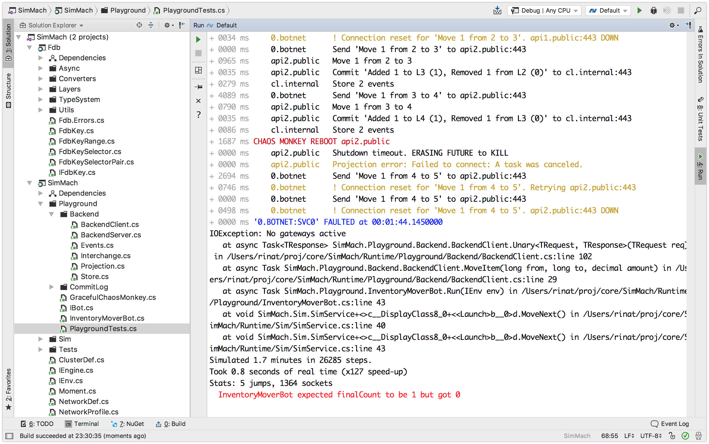

# sim-cluster

This is my current work-in-progress on running event-driven
distributed systems inside [discrete event simulation](https://en.wikipedia.org/wiki/Discrete_event_simulation).

## Try it out

This is a .NET Core 2.0 project. You should be able to open it (e.g. in JetBrains Rider) and run.

The output should be something like this:



## Details

`Sim-cluster` builds up on the previous work:

1. [SimCPU](https://github.com/abdullin/simcpu) - simulate CPU job
   scheduler (easier than it sounds);
2. [SimRing](https://gist.github.com/abdullin/af7c9b7fd4aa58cadcc346c8e194d9ab) -
   simulate ring benchmark;
3. [SimAsync](https://github.com/abdullin/simasync) - plug into .NET
   Core async/await to simulate processes running in parallel;
4. [SimCluster](https://github.com/abdullin/sim-cluster) - this.

This project introduces:

* **Simplified simulation of TCP/IP**. This includes connection
  handshake, SEQ/ACK numbers and reorder buffers. There is now proper
  shutdown sequence and no packet re-transmissions.
* **Durable node storage** in form of per-machine folders used by the
  LMDB database.
* **Configurable system topology** - machines, services and network
  connections.
* **Simulation plans** that specify how we want to run the simulated
  topology. This includes a graceful chaos monkey.
* **Simulating power outages** by erasing future for the affected
  systems.
* **Network profiles** - ability to configure latency, packet loss
  ratio and logging per network connection.

## Dive in

To dive in take a look at the `Program.cs`. It generates a simulation
scenario that is then executed.

A scenario could look like this:

```
public static ScenarioDef InventoryMoverBotOver3GConnection() {
    var test = new ScenarioDef();
    
    test.Connect("botnet", "public", NetworkProfile.Mobile3G);
    test.Connect("public", "internal", NetworkProfile.AzureIntranet);
    test.AddService("cl.internal", InstallCommitLog);
    test.AddService("api1.public", InstallBackend("cl.internal"));
    test.AddService("api2.public", InstallBackend("cl.internal"));
    
    var mover = new InventoryMoverBot {
        Servers = new []{"api1.public", "api2.public"},
        RingSize = 7,
        Iterations = 30,
        Delay = 4.Sec(),
        HaltOnCompletion = true
    };
    
    test.AddBot(mover);
    
    var monkey = new GracefulChaosMonkey {
        ApplyToMachines = s => s.StartsWith("api"),
        DelayBetweenStrikes = r => r.Next(5,10).Sec()
    };
    test.Plan = monkey.Run;
    return test;
}
```
